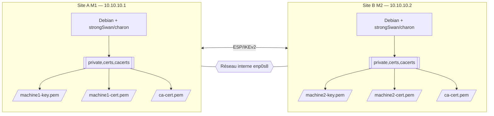
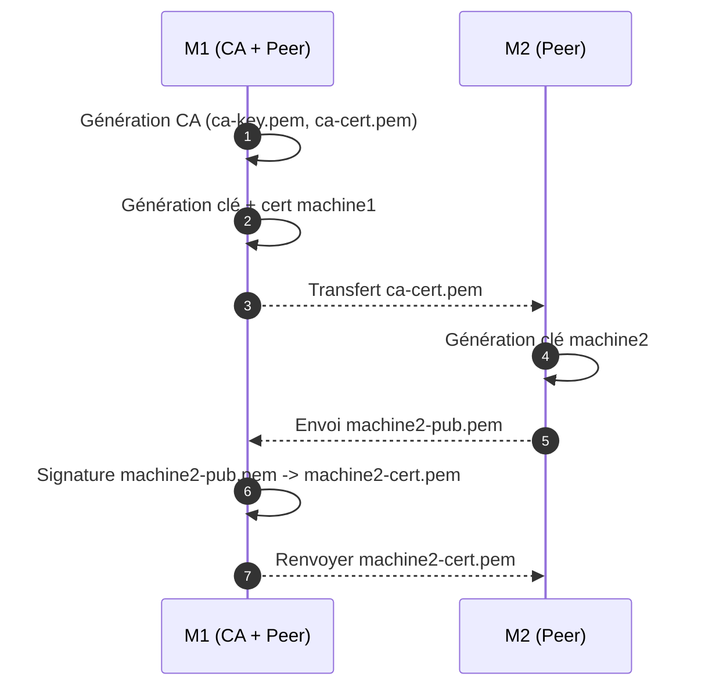
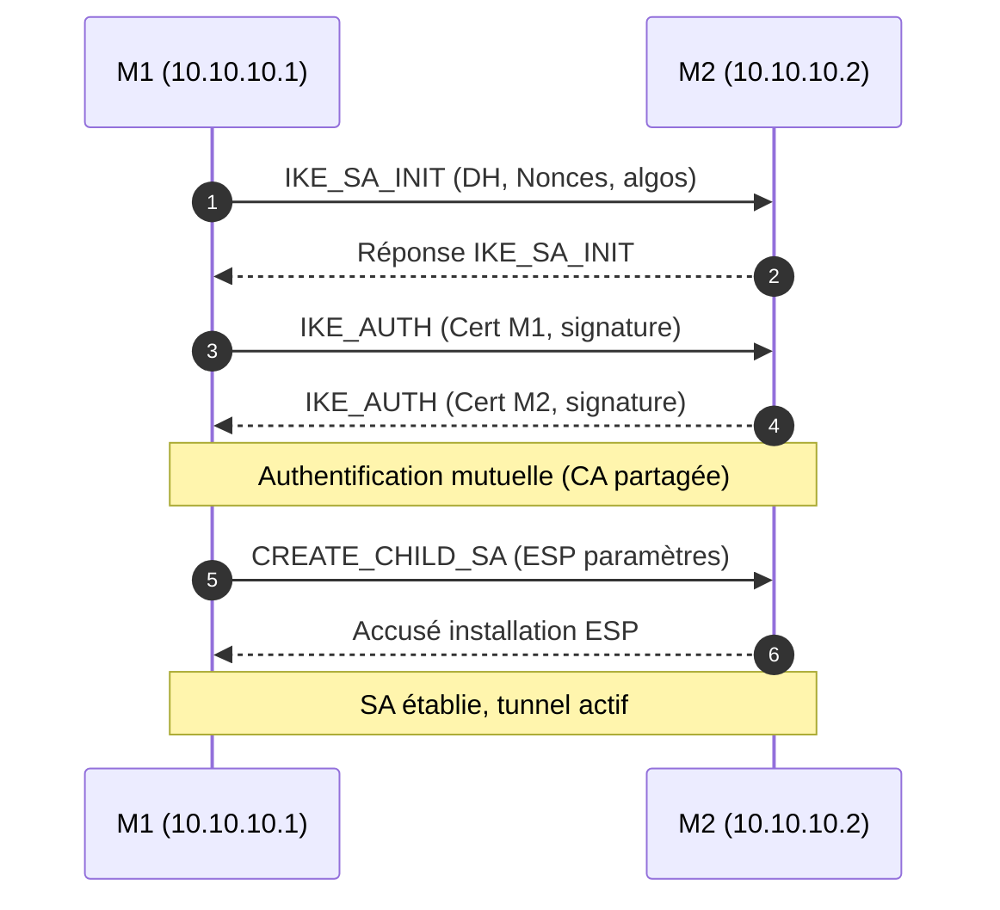
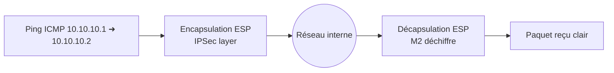
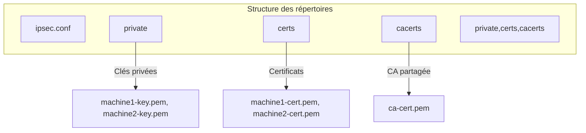

# 🧱 Atelier : VPN IPSec Site-to-Site avec strongSwan

---

## ⚙️ Prérequis

| Élément            | Détails                                                |
| ------------------ | ------------------------------------------------------ |
| OS                 | Debian 12 (ou Ubuntu équivalent)                       |
| Nombre de machines | 2 (M1 et M2)                                           |
| Interface réseau   | `enp0s8` (réseau interne)                              |
| Adresses IP        | M1 = `10.10.10.1`, M2 = `10.10.10.2`                   |
| Privilèges         | Accès `sudo` sur les deux machines                     |
| Connectivité       | SSH possible entre M1 et M2                            |
| But final          | Chiffrer le trafic ICMP entre M1 et M2 via IPSec IKEv2 |

---

## 1️⃣ Contexte & objectif

Vous disposez de deux machines Debian reliées sur un réseau interne :

| Machine            | IP interne | Interface | Rôle                                  |
| ------------------ | ---------- | --------- | ------------------------------------- |
| **Machine 1 (M1)** | 10.10.10.1 | enp0s8    | Autorité de certification (CA) + Peer |
| **Machine 2 (M2)** | 10.10.10.2 | enp0s8    | Peer distant                          |

🎯 **Objectif :**
Mettre en place un tunnel **IPSec IKEv2** site-à-site qui chiffre tout le trafic entre M1 et M2.

---

### 🧩 Schéma d’architecture globale

**site (M1 / M2) :** chaque point de terminaison du VPN, disposant de sa propre configuration strongSwan et d’un certificat unique.

**cert :** certificat X.509 propre à chaque machine (machine1-cert.pem, machine2-cert.pem) signé par la CA. Il prouve l’identité du site lors de l’échange IKEv2.

**cacert :** certificat d’autorité (ca-cert.pem). C’est la racine de confiance commune utilisée pour vérifier la validité des certificats des deux sites.

**cert vs cacert :** 

- cert = identité spécifique d’un hôte, signé par la CA.  
- cacert = autorité racine utilisée pour signer et valider les certs.  
  => sans cacert, les certs ne sont pas reconnus comme valides.

**ESP (Encapsulating Security Payload) :** protocole du tunnel IPSec qui chiffre les paquets IP entre M1 et M2.  Les échanges ICMP ou TCP deviennent invisibles sur le réseau : seule une charge ESP chiffrée circule.

**IKEv2 (Internet Key Exchange v2) :** protocole d’échange de clés sécurisé utilisé pour négocier, authentifier et établir les associations de sécurité (SAs) IPSec entre M1 et M2. 




---

## 2️⃣ Préparation de l’environnement

### Sur **les deux machines**

```bash
sudo apt update
sudo apt install -y \
  strongswan strongswan-starter strongswan-pki \
  libstrongswan-standard-plugins libstrongswan-extra-plugins libcharon-extra-plugins \
  libgmp10
```

💡 Ces paquets assurent :

- `strongswan` : le moteur IPSec,
- `strongswan-pki` : l’outil de gestion des certificats `pki`,
- `strongswan-starter` : la commande `ipsec`,
- `libstrongswan-*` : tous les algorithmes cryptographiques nécessaires.

---

## 3️⃣ Coupure du bruit TPM

```bash
sudo install -d -m 755 /etc/strongswan.d/pki/plugins
printf "tpm {\n  load = no\n}\n" | sudo tee /etc/strongswan.d/pki/plugins/tpm.conf >/dev/null

sudo install -d -m 755 /etc/strongswan.d/charon/plugins
printf "tpm {\n  load = no\n}\n" | sudo tee /etc/strongswan.d/charon/plugins/tpm.conf >/dev/null
```

---

## 4️⃣ Préparation des répertoires PKI

```bash
mkdir -p ~/pki/{cacerts,certs,private}
chmod 700 ~/pki
```

---

## 5️⃣ Génération de la CA et certificats

### 🔹 Sur M1 — génération CA et certs locaux

```bash
pki --gen --type rsa --size 4096 --outform pem > ~/pki/private/ca-key.pem
pki --self --ca --lifetime 3650 \
  --in  ~/pki/private/ca-key.pem --type rsa \
  --dn  "CN=VPN-CA" \
  --outform pem > ~/pki/cacerts/ca-cert.pem
```

Puis génération de la clé et du certificat de M1 :

```bash
pki --gen --type rsa --size 4096 --outform pem > ~/pki/private/machine1-key.pem
pki --pub --in ~/pki/private/machine1-key.pem --type rsa | \
pki --issue --lifetime 1825 \
  --cacert ~/pki/cacerts/ca-cert.pem \
  --cakey  ~/pki/private/ca-key.pem \
  --dn "CN=10.10.10.1" --san "10.10.10.1" \
  --flag serverAuth --flag ikeIntermediate \
  --outform pem > ~/pki/certs/machine1-cert.pem
```

### 🔹 Schéma : flux PKI (CA, signature, distribution)



---

## 6️⃣ Configuration IPSec

```bash
sudo nano /etc/ipsec.conf
```

Contenu (M1) :

```
config setup
    charondebug="ike 2, knl 2, cfg 2"
conn net-to-net
    left=10.10.10.1
    leftid="10.10.10.1"
    leftcert=machine1-cert.pem
    right=10.10.10.2
    rightid="10.10.10.2"
    rightcert=machine2-cert.pem
    auto=start
    keyexchange=ikev2
    authby=rsasig
```

(M2) :

```
config setup
    charondebug="ike 2, knl 2, cfg 2"
conn net-to-net
    left=10.10.10.2
    leftid="10.10.10.2"
    leftcert=machine2-cert.pem
    right=10.10.10.1
    rightid="10.10.10.1"
    rightcert=machine1-cert.pem
    auto=start
    keyexchange=ikev2
    authby=rsasig
```

---

## 7️⃣ Démarrage et vérification du tunnel

```bash
sudo systemctl restart strongswan-starter
sudo systemctl enable strongswan-starter
sudo ipsec statusall
```

### 🔹 Schéma : flux IKEv2 et établissement du tunnel



---

## 8️⃣ Tests de connectivité et chiffrement

### Ping

```bash
ping -c 3 10.10.10.2  # depuis M1
ping -c 3 10.10.10.1  # depuis M2
```

### Vérification du trafic chiffré

```bash
sudo tcpdump -i enp0s8 esp
```

Les paquets **ESP** doivent apparaître.

### 🔹 Schéma : flux ESP chiffré



---

## 9️⃣ Dépannage & Nettoyage

### Diagnostic

```bash
sudo journalctl -u strongswan-starter -e | tail -20
sudo ipsec restart
sudo ipsec listcerts
```

### Nettoyage (M1/M2)

```bash
sudo systemctl stop strongswan-starter
sudo apt purge -y strongswan strongswan-pki strongswan-starter \
  libcharon-extra-plugins libstrongswan-extra-plugins libstrongswan-standard-plugins
sudo rm -rf /etc/ipsec.d/* ~/pki
```

### 🔹 Schéma : emplacements des fichiers clés



---

## ✅ Résultat final attendu

- Le tunnel `net-to-net` se monte automatiquement (`auto=start`)
- Le trafic ICMP est chiffré (ESP visible dans tcpdump)
- Aucun bruit TPM n’apparaît
- Les certificats et clés sont correctement déployés dans `/etc/ipsec.d/`

Parfait — je te fournis **4 scripts prêts à l’emploi** (textes copiables) :

- `cleanup-m1.sh` — nettoyage complet à lancer sur **M1 (10.10.10.1)**

- `cleanup-m2.sh` — nettoyage complet à lancer sur **M2 (10.10.10.2)**

- `setup-m1.sh` — script de préparation, génération CA & M1, signature automatique du pub M2 si présent, déploiement et démarrage (à lancer sur **M1**)

- `setup-m2.sh` — script de préparation, génération M2, envoi pub vers M1, réception du cert signé, déploiement et démarrage (à lancer sur **M2**)

---

### 1) cleanup-m1.sh — nettoyage (exécuter sur M1 = 10.10.10.1)

```bash
#!/usr/bin/env bash
set -euo pipefail
# cleanup-m1.sh
# Nettoyage complet strongSwan + PKI sur M1 (10.10.10.1)
# Execute as regular user. sudo will be used where nécessaire.

# Variables (adapter si besoin)
INTERFACE="enp0s8"

echo ">> Arrêt du service strongSwan"
sudo systemctl stop strongswan-starter || true
sudo systemctl disable strongswan-starter || true

echo ">> Suppression paquets strongSwan (purge)"
sudo apt-get update -y
sudo apt-get purge -y strongswan strongswan-starter strongswan-pki \
  libcharon-extra-plugins libstrongswan-extra-plugins libstrongswan-standard-plugins || true

echo ">> Nettoyage des fichiers de configuration et PKI"
sudo rm -rf /etc/ipsec.d/* /etc/strongswan.d/* /etc/ipsec.conf /etc/ipsec.secrets || true
rm -rf ~/pki ~/machine2-pub.pem ~/machine2-cert.pem || true

echo ">> Réinitialisation des fichiers de logs (optionnel)"
# ne supprime pas les logs système, mais on peut vider d'éventuels fichiers locaux
# sudo journalctl --rotate && sudo journalctl --vacuum-time=1s

echo ">> Nettoyage terminé sur M1."
echo "Vérifiez manuellement : sudo ls -la /etc/ipsec.d"
```

---

### 2) cleanup-m2.sh — nettoyage (exécuter sur M2 = 10.10.10.2)

```bash
#!/usr/bin/env bash
set -euo pipefail
# cleanup-m2.sh
# Nettoyage complet strongSwan + PKI sur M2 (10.10.10.2)

INTERFACE="enp0s8"

echo ">> Arrêt du service strongSwan"
sudo systemctl stop strongswan-starter || true
sudo systemctl disable strongswan-starter || true

echo ">> Suppression paquets strongSwan (purge)"
sudo apt-get update -y
sudo apt-get purge -y strongswan strongswan-starter strongswan-pki \
  libcharon-extra-plugins libstrongswan-extra-plugins libstrongswan-standard-plugins || true

echo ">> Nettoyage des fichiers de configuration et PKI"
sudo rm -rf /etc/ipsec.d/* /etc/strongswan.d/* /etc/ipsec.conf /etc/ipsec.secrets || true
rm -rf ~/pki ~/machine2-pub.pem ~/machine2-cert.pem ~/machine1-pub.pem || true

echo ">> Nettoyage terminé sur M2."
echo "Vérifiez manuellement : sudo ls -la /etc/ipsec.d"
```

---

###3) setup-m1.sh — installer + générer CA & M1 + signer pub M2 automatiquement (exécuter sur M1)

> Avant d’exécuter : édite les variables `REMOTE_USER` et `REMOTE_HOST` si nécessaire (par défaut `REMOTE_HOST=10.10.10.2`).

```bash
#!/usr/bin/env bash
set -euo pipefail
# setup-m1.sh
# Script à lancer sur M1 (10.10.10.1)
# Variables -> Modifier si besoin
REMOTE_USER="${REMOTE_USER:-user}"
REMOTE_HOST="${REMOTE_HOST:-10.10.10.2}"
REMOTE_IP="${REMOTE_IP:-10.10.10.2}"
LOCAL_IP="${LOCAL_IP:-10.10.10.1}"
INTERFACE="${INTERFACE:-enp0s8}"
WAIT_TIMEOUT="${WAIT_TIMEOUT:-300}"  # secondes max d'attente pour machine2-pub.pem

echo "### M1 setup starting (LOCAL_IP=${LOCAL_IP}, REMOTE=${REMOTE_USER}@${REMOTE_HOST})"

echo "1) Installer paquets nécessaires (avec recommends)"
sudo apt update
sudo apt install -y --install-recommends \
  strongswan strongswan-starter strongswan-pki \
  libstrongswan-standard-plugins libstrongswan-extra-plugins libcharon-extra-plugins \
  libgmp10

echo "2) Désactiver plugin TPM pour réduire le bruit"
sudo install -d -m 755 /etc/strongswan.d/pki/plugins
printf "tpm {\n  load = no\n}\n" | sudo tee /etc/strongswan.d/pki/plugins/tpm.conf >/dev/null
sudo install -d -m 755 /etc/strongswan.d/charon/plugins
printf "tpm {\n  load = no\n}\n" | sudo tee /etc/strongswan.d/charon/plugins/tpm.conf >/dev/null

echo "3) Préparer arborescence PKI dans \$HOME"
mkdir -p ~/pki/{cacerts,certs,private}
chmod 700 ~/pki

# 4) Générer CA si pas existante
if [ ! -f ~/pki/private/ca-key.pem ] || [ ! -f ~/pki/cacerts/ca-cert.pem ]; then
  echo "4.a Génération CA (4096 bits)"
  pki --gen --type rsa --size 4096 --outform pem > ~/pki/private/ca-key.pem
  pki --self --ca --lifetime 3650 \
    --in  ~/pki/private/ca-key.pem --type rsa \
    --dn  "CN=VPN-CA" \
    --outform pem > ~/pki/cacerts/ca-cert.pem
else
  echo "4.b CA déjà présente, on la réutilise"
fi

# 5) Générer clé et certificat M1 si manquent
if [ ! -f ~/pki/private/machine1-key.pem ]; then
  echo "5.a Génération clé privée machine1"
  pki --gen --type rsa --size 4096 --outform pem > ~/pki/private/machine1-key.pem
fi
if [ ! -f ~/pki/certs/machine1-cert.pem ]; then
  echo "5.b Emission du certificat machine1"
  pki --pub --in ~/pki/private/machine1-key.pem --type rsa | \
    pki --issue --lifetime 1825 \
      --cacert ~/pki/cacerts/ca-cert.pem \
      --cakey  ~/pki/private/ca-key.pem \
      --dn "CN=${LOCAL_IP}" --san "${LOCAL_IP}" \
      --flag serverAuth --flag ikeIntermediate \
      --outform pem > ~/pki/certs/machine1-cert.pem
fi

# 6) Tenter de copier la CA vers M2 (silencieux si échec)
echo "6) Tentative copie de la CA vers ${REMOTE_USER}@${REMOTE_HOST}"
if scp ~/pki/cacerts/ca-cert.pem "${REMOTE_USER}@${REMOTE_HOST}:/home/${REMOTE_USER}/" 2>/dev/null; then
  echo "-> CA copiée vers ${REMOTE_HOST}:/home/${REMOTE_USER}/"
else
  echo "-> Échec copie CA (vérifie accès SSH). Tu peux copier manuellement:"
  echo "   scp ~/pki/cacerts/ca-cert.pem ${REMOTE_USER}@${REMOTE_HOST}:/home/${REMOTE_USER}/"
fi

# 7) Déploiement local des fichiers dans /etc/ipsec.d
echo "7) Déployer certificats/clefs dans /etc/ipsec.d (sudo)"
sudo install -d -m 755 /etc/ipsec.d/private /etc/ipsec.d/certs /etc/ipsec.d/cacerts
sudo cp -v ~/pki/private/machine1-key.pem /etc/ipsec.d/private/
sudo cp -v ~/pki/certs/machine1-cert.pem   /etc/ipsec.d/certs/
sudo cp -v ~/pki/cacerts/ca-cert.pem       /etc/ipsec.d/cacerts/

# 8) Attendre la clé publique machine2-pub.pem (envoyée par M2)
echo "8) Attente de /home/${USER}/machine2-pub.pem (timeout ${WAIT_TIMEOUT}s)"
elapsed=0
interval=3
while [ $elapsed -lt $WAIT_TIMEOUT ]; do
  if [ -f ~/machine2-pub.pem ]; then
    echo "-> Trouvé ~/machine2-pub.pem"
    break
  fi
  sleep $interval
  elapsed=$((elapsed + interval))
done

if [ -f ~/machine2-pub.pem ]; then
  echo "9) Signature de machine2-pub.pem"
  pki --issue --lifetime 1825 \
    --cacert ~/pki/cacerts/ca-cert.pem \
    --cakey  ~/pki/private/ca-key.pem \
    --in ~/machine2-pub.pem \
    --dn "CN=${REMOTE_IP}" --san "${REMOTE_IP}" \
    --flag serverAuth --flag ikeIntermediate \
    --outform pem > ~/pki/certs/machine2-cert.pem

  echo "-> Envoi du certificat signé vers ${REMOTE_USER}@${REMOTE_HOST}"
  if scp ~/pki/certs/machine2-cert.pem "${REMOTE_USER}@${REMOTE_HOST}:/home/${REMOTE_USER}/" 2>/dev/null; then
    echo "-> Cert renvoyé avec succès"
  else
    echo "-> Échec envoi cert (vérifie SSH). Instructions :"
    echo "   scp ~/pki/certs/machine2-cert.pem ${REMOTE_USER}@${REMOTE_HOST}:/home/${REMOTE_USER}/"
  fi
else
  echo "-> machine2-pub.pem non trouvé dans le délai. Skip signature automatique. Tu peux exécuter manuellement sur M1 :"
  echo "   pki --issue --lifetime 1825 --cacert ~/pki/cacerts/ca-cert.pem --cakey ~/pki/private/ca-key.pem --in /chemin/machine2-pub.pem --dn \"CN=${REMOTE_IP}\" --san \"${REMOTE_IP}\" --flag serverAuth --flag ikeIntermediate --outform pem > ~/pki/certs/machine2-cert.pem"
fi

# 10) Ecrire ipsec.conf pour M1 (écrase l'ancien)
echo "10) Écriture /etc/ipsec.conf (M1)"
sudo tee /etc/ipsec.conf >/dev/null <<EOF
config setup
    charondebug="ike 2, knl 2, cfg 2"

conn net-to-net
    left=${LOCAL_IP}
    leftid="${LOCAL_IP}"
    leftcert=machine1-cert.pem
    right=${REMOTE_IP}
    rightid="${REMOTE_IP}"
    rightcert=machine2-cert.pem
    auto=start
    keyexchange=ikev2
    authby=rsasig
EOF

# 11) Redémarrer le service et vérifier
echo "11) Redémarrage strongswan-starter et vérification"
sudo systemctl restart strongswan-starter
sudo systemctl enable strongswan-starter
echo "Status (last 20 lines):"
sudo systemctl status strongswan-starter --no-pager | sed -n '1,120p'

echo "12) Afficher état ipsec"
sudo ipsec statusall || true

echo "### FIN setup-m1.sh"
echo "Si la connexion n'est pas UP, vérifie journaux : sudo journalctl -u strongswan-starter -e"
```

---

### 4) setup-m2.sh — installer + générer M2 + envoyer pub et récupérer cert signé (exécuter sur M2)

> Avant d’exécuter : édite `REMOTE_USER`/`REMOTE_HOST` si besoin (`REMOTE_HOST` doit pointer vers M1).

```bash
#!/usr/bin/env bash
set -euo pipefail
# setup-m2.sh
# Script à lancer sur M2 (10.10.10.2)
# Variables -> Modifier si besoin
REMOTE_USER="${REMOTE_USER:-user}"
REMOTE_HOST="${REMOTE_HOST:-10.10.10.1}"
REMOTE_IP="${REMOTE_IP:-10.10.10.1}"
LOCAL_IP="${LOCAL_IP:-10.10.10.2}"
INTERFACE="${INTERFACE:-enp0s8}"
WAIT_TIMEOUT="${WAIT_TIMEOUT:-300}"  # attente pour machine2-cert.pem signé

echo "### M2 setup starting (LOCAL_IP=${LOCAL_IP}, REMOTE=${REMOTE_USER}@${REMOTE_HOST})"

echo "1) Installer paquets nécessaires"
sudo apt update
sudo apt install -y --install-recommends \
  strongswan strongswan-starter strongswan-pki \
  libstrongswan-standard-plugins libstrongswan-extra-plugins libcharon-extra-plugins \
  libgmp10

echo "2) Désactiver plugin TPM pour réduire le bruit"
sudo install -d -m 755 /etc/strongswan.d/pki/plugins
printf "tpm {\n  load = no\n}\n" | sudo tee /etc/strongswan.d/pki/plugins/tpm.conf >/dev/null
sudo install -d -m 755 /etc/strongswan.d/charon/plugins
printf "tpm {\n  load = no\n}\n" | sudo tee /etc/strongswan.d/charon/plugins/tpm.conf >/dev/null

echo "3) Préparer arborescence PKI dans \$HOME"
mkdir -p ~/pki/{cacerts,certs,private}
chmod 700 ~/pki

# 4) Récupérer CA depuis M1 (tentative)
echo "4) Tentative récupération de la CA depuis ${REMOTE_USER}@${REMOTE_HOST}"
if scp "${REMOTE_USER}@${REMOTE_HOST}:/home/${REMOTE_USER}/ca-cert.pem" ~/pki/cacerts/ 2>/dev/null; then
  echo "-> CA récupérée et placée dans ~/pki/cacerts/"
else
  if [ -f ~/ca-cert.pem ]; then
    mv ~/ca-cert.pem ~/pki/cacerts/
    echo "-> CA trouvée localement et déplacée ~/pki/cacerts/"
  else
    echo "-> Échec récupération CA. Copie manuelle requise: scp ${REMOTE_USER}@${REMOTE_HOST}:/home/${REMOTE_USER}/ca-cert.pem ~/pki/cacerts/"
  fi
fi

# 5) Génération clé privée M2
if [ ! -f ~/pki/private/machine2-key.pem ]; then
  echo "5) Génération clé privée machine2"
  pki --gen --type rsa --size 4096 --outform pem > ~/pki/private/machine2-key.pem
fi

# 6) Extraire pub et envoyer à M1 pour signature
echo "6) Extraction clé publique et envoi à ${REMOTE_USER}@${REMOTE_HOST}"
pki --pub --in ~/pki/private/machine2-key.pem --type rsa > ~/machine2-pub.pem
if scp ~/machine2-pub.pem "${REMOTE_USER}@${REMOTE_HOST}:/home/${REMOTE_USER}/" 2>/dev/null; then
  echo "-> machine2-pub.pem envoyé vers ${REMOTE_HOST}"
else
  echo "-> Échec envoi machine2-pub.pem. Récupère manuellement sur M1 puis signe."
  echo "   scp ~/machine2-pub.pem ${REMOTE_USER}@${REMOTE_HOST}:/home/${REMOTE_USER}/"
fi

# 7) Attendre le certificat signé renvoyé depuis M1
echo "7) Attente de ~/machine2-cert.pem (timeout ${WAIT_TIMEOUT}s)"
elapsed=0
interval=3
while [ $elapsed -lt $WAIT_TIMEOUT ]; do
  if [ -f ~/machine2-cert.pem ]; then
    echo "-> Cert signé reçu localement: ~/machine2-cert.pem"
    break
  fi
  # tentative automatique de récupérer depuis M1 si accessible
  if scp "${REMOTE_USER}@${REMOTE_HOST}:/home/${REMOTE_USER}/pki/certs/machine2-cert.pem" ~/machine2-cert.pem 2>/dev/null; then
    echo "-> Récupération automatique depuis M1 réussie"
    break
  fi
  if scp "${REMOTE_USER}@${REMOTE_HOST}:/home/${REMOTE_USER}/machine2-cert.pem" ~/machine2-cert.pem 2>/dev/null; then
    echo "-> Récupération automatique depuis M1 réussie (alt path)"
    break
  fi
  sleep $interval
  elapsed=$((elapsed + interval))
done

if [ ! -f ~/machine2-cert.pem ]; then
  echo "-> Cert signé non reçu dans le délai. Tu dois récupérer le fichier depuis M1 manuellement."
  echo "   scp ${REMOTE_USER}@${REMOTE_HOST}:/home/${REMOTE_USER}/pki/certs/machine2-cert.pem ~/"
  exit 1
fi

# 8) Déployer les fichiers dans /etc/ipsec.d
echo "8) Déploiement dans /etc/ipsec.d (sudo)"
sudo install -d -m 755 /etc/ipsec.d/private /etc/ipsec.d/certs /etc/ipsec.d/cacerts
sudo cp -v ~/pki/private/machine2-key.pem /etc/ipsec.d/private/
sudo cp -v ~/machine2-cert.pem            /etc/ipsec.d/certs/
sudo cp -v ~/pki/cacerts/ca-cert.pem      /etc/ipsec.d/cacerts/

# 9) Rédiger ipsec.conf pour M2
echo "9) Écriture /etc/ipsec.conf (M2)"
sudo tee /etc/ipsec.conf >/dev/null <<EOF
config setup
    charondebug="ike 2, knl 2, cfg 2"

conn net-to-net
    left=${LOCAL_IP}
    leftid="${LOCAL_IP}"
    leftcert=machine2-cert.pem
    right=${REMOTE_IP}
    rightid="${REMOTE_IP}"
    rightcert=machine1-cert.pem
    auto=start
    keyexchange=ikev2
    authby=rsasig
EOF

# 10) Redémarrer le service et vérifier
echo "10) Redémarrage strongswan-starter et vérification"
sudo systemctl restart strongswan-starter
sudo systemctl enable strongswan-starter
echo "Status (last lines):"
sudo systemctl status strongswan-starter --no-pager | sed -n '1,120p'

echo "11) Afficher état ipsec"
sudo ipsec statusall || true

echo "12) Test ping vers M1"
ping -c 3 "${REMOTE_IP}" || true

echo "### FIN setup-m2.sh"
echo "Si la connexion n'est pas UP, vérifie journaux : sudo journalctl -u strongswan-starter -e"
```

---

### Notes d’utilisation & recommandations rapides

1. **Édite les variables en tête** (`REMOTE_USER`, `REMOTE_HOST`, `LOCAL_IP`, `INTERFACE`) sur chaque script si ton utilisateur ou IP diffèrent.

2. Les scripts essaient d’utiliser `scp` pour automatiser les transferts ; cela suppose un accès SSH entre les machines (mieux : configurer une clé SSH). Si `scp` échoue, le script t’indiquera la commande exacte à exécuter manuellement.

3. Les opérations `pki` sont exécutées sans `sudo` (création des fichiers dans `$HOME`). Les copies vers `/etc/ipsec.d` utilisent `sudo`. Ceci évite d’avoir des fichiers appartenant à root dans ton répertoire utilisateur.

4. Les scripts **désactivent le plugin TPM** pour éviter le bruit log.

5. Les scripts écrasent `/etc/ipsec.conf` — si tu as configurations personnalisées, sauvegarde-les avant : `sudo cp /etc/ipsec.conf /etc/ipsec.conf.bak`.

6. Temps d’attente (`WAIT_TIMEOUT`) configurable : si ton réseau est lent, augmente-le.
