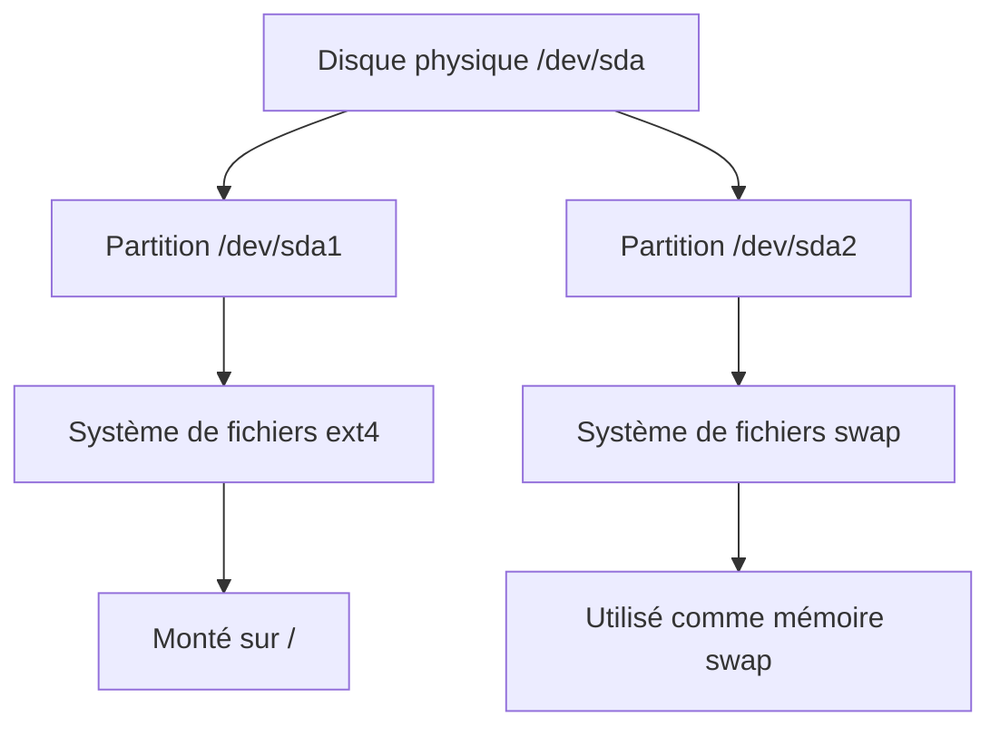

Parfait 👌  
Voici la **Phase 3 – Version 2 améliorée** de ton **Atelier 1 : Découverte du disque et de ses partitions**, intégrant **tous les points issus de la critique analytique**.  
Cette version est prête à être testée et validée comme version finale de référence.

---

# 🧰 Atelier 1 – Découverte du disque et de ses partitions *(Version 2 améliorée)*

### 🔖 Informations générales

- **Durée estimée** : 40 à 50 minutes

- **Niveau** : débutant à intermédiaire

- **Objectif global** : comprendre la structure et la composition des disques sous Linux Debian, identifier les partitions, leur type, leur système de fichiers et leur point de montage.

- **Prérequis** : machine Debian 12/13 avec droits `sudo` et, si possible, un second disque virtuel (`sdb` d’environ 2 Go).

---

## 1️⃣ Contexte et objectif

Un administrateur système vient de recevoir une machine Debian fraîchement installée.  
Avant de configurer des services ou d’ajouter de nouveaux volumes, il doit **dresser un inventaire complet du stockage** : disques, partitions, systèmes de fichiers et points de montage.

> 🎯 À la fin de l’atelier, vous saurez :
> 
> - Identifier les disques visibles par le système.
> 
> - Lire une table de partitions (MBR/GPT).
> 
> - Associer chaque partition à son système de fichiers et point de montage.
> 
> - Produire un inventaire synthétique exportable.

---

## 2️⃣ Préparation de l’environnement

### Étape 1 : Vérifier la présence des disques

```bash
sudo ls /dev/sd*
```

- Si vous voyez `/dev/sda` et `/dev/sdb`, c’est parfait.

- Si vous êtes dans un environnement cloud, les noms peuvent être différents :
  
  - `/dev/vda` (VirtIO)
  
  - `/dev/nvme0n1` (disque NVMe)

### Étape 2 : Nettoyer les montages résiduels

```bash
sudo umount -a 2>/dev/null || true
```

> 💡 **Astuce :** Si vous venez d’ajouter un disque virtuel dans VirtualBox, exécutez :
> 
> ```bash
> sudo partprobe
> ```
> 
> pour que le noyau prenne en compte le nouveau disque sans redémarrage.

---

## 3️⃣ Étapes pas à pas

### 🔹 Étape 1 – Inspection du disque principal

```bash
lsblk
```

**Résultat attendu typique :**

```
NAME   MAJ:MIN RM  SIZE RO TYPE MOUNTPOINTS
sda      8:0    0   20G  0 disk 
├─sda1   8:1    0   19G  0 part /
└─sda2   8:2    0    1G  0 part [SWAP]
sdb      8:16   0    2G  0 disk
```

**Interprétation :**

- `TYPE=disk` → disque physique complet

- `TYPE=part` → partition

- `MOUNTPOINTS` indique où elle est montée

> 🧠 **Remarque :** les noms changent selon le type de disque (`sda`, `vda`, `nvme0n1`), mais la logique reste identique.

---

### 🔹 Étape 2 – Lecture de la table de partition

```bash
sudo fdisk -l
```

**Exemple :**

```
Disk /dev/sda: 20 GiB, 21474836480 bytes, 41943040 sectors
Disklabel type: gpt
Device       Start      End  Sectors  Size Type
/dev/sda1     2048 39843839 39841792   19G Linux filesystem
/dev/sda2  39843840 41940991  2097152    1G Linux swap
```

**Analyse :**

- `Disklabel type` → GPT

- `Start/End/Sectors` → positions physiques

- `Type` → type de partition

---

### 🔹 Étape 3 – Vérification via parted

```bash
sudo parted -l
```

**Extrait attendu :**

```
Model: ATA VBOX HARDDISK (scsi)
Disk /dev/sda: 21.5GB
Partition Table: gpt
Number  Start   End     Size    File system  Name  Flags
 1      1049kB  20.4GB  20.4GB  ext4
 2      20.4GB  21.5GB  1074MB  linux-swap
```

**Intérêt :**  
`parted` gère mieux les disques GPT et affiche la table sous un format plus lisible.

---

### 🔹 Étape 4 – Identifier les systèmes de fichiers

```bash
sudo blkid
```

**Exemple :**

```
/dev/sda1: UUID="32a7...bcd" TYPE="ext4" PARTLABEL="root"
/dev/sda2: UUID="9f3e...21b" TYPE="swap"
```

> `UUID` = identifiant unique du système de fichiers.  
> `TYPE` = nature du FS (ext4, xfs, swap, etc.).

---

### 🔹 Étape 5 – Confirmer les points de montage

```bash
df -Th
```

**Exemple :**

```
Filesystem     Type  Size  Used Avail Use% Mounted on
/dev/sda1      ext4   19G  4.0G   15G  22% /
tmpfs          tmpfs 1.9G     0  1.9G   0% /dev/shm
```

---

### 🔹 Étape 6 – Lecture bas niveau du noyau

```bash
cat /proc/partitions
```

**Extrait :**

```
major minor  #blocks  name
   8        0   20971520 sda
   8        1   19920896 sda1
   8        2    1048576 sda2
```

> Cette vue brute est utile pour diagnostiquer des problèmes bas niveau ou pour les scripts système.

---

### 🔹 Étape 7 – Détection de type brut du contenu

```bash
sudo file -s /dev/sda1
```

**Exemple :**

```
/dev/sda1: Linux rev 1.0 ext4 filesystem data, UUID=32a7bcd1..., volume name "rootfs"
```

---

### 🔹 Étape 8 – Résumé global et export

```bash
lsblk -f
```

**Résultat :**

```
NAME   FSTYPE LABEL UUID                                 MOUNTPOINTS
sda                                                          
├─sda1 ext4         32a7bcd1-...                            /
└─sda2 swap         9f3e21b-...                             [SWAP]
sdb
```

Exporter le rapport :

```bash
lsblk -f > /tmp/inventaire_disques.txt
cat /tmp/inventaire_disques.txt
```

---

## 4️⃣ Vérification & mini-exercice de synthèse

👉 **Tâche :**  
Créez un petit tableau (papier ou éditeur de texte) récapitulant vos observations :

| Nom du périphérique | Taille | Type | Système de fichiers | Point de montage |
| ------------------- | ------ | ---- | ------------------- | ---------------- |
| `/dev/sda1`         | 19G    | part | ext4                | `/`              |
| `/dev/sda2`         | 1G     | part | swap                | `[SWAP]`         |
| `/dev/sdb`          | 2G     | disk | —                   | —                |

---

## 5️⃣ Nettoyage / Rollback

Aucune désinstallation nécessaire.  
Si vous aviez ajouté un disque virtuel `sdb` :

1. Éteignez la VM.

2. Retirez le disque depuis VirtualBox ou votre console cloud.

Optionnel : supprimer le fichier d’inventaire.

```bash
rm /tmp/inventaire_disques.txt
```

---

## 6️⃣ Astuces & pièges courants

| Problème                        | Cause probable                   | Solution                                         |
| ------------------------------- | -------------------------------- | ------------------------------------------------ |
| Le disque ajouté n’apparaît pas | Le noyau n’a pas relu la table   | `sudo partprobe`                                 |
| Les noms `/dev/sda` changent    | Ordre de détection du contrôleur | Identifier via `lsblk -S`                        |
| Pas de FS détecté               | Partition non formatée           | À traiter dans Atelier 2                         |
| UUID manquant                   | FS corrompu ou inexistant        | Recréer avec `mkfs.ext4 -U random`               |
| Affichage tronqué               | Terminal trop étroit             | Utiliser `lsblk -o NAME,SIZE,FSTYPE,MOUNTPOINTS` |

---

## 7️⃣ Visualisation hiérarchique (schéma Mermaid)



---

## 8️⃣ Transition vers l’atelier suivant

> 🔜 **Atelier 2 : Création et formatage d’une nouvelle partition**
> 
> Vous apprendrez à créer une partition sur le disque `sdb`, à la formater en ext4 et à la monter sur `/data`.

---

Souhaitez-vous que je te prépare maintenant **Atelier 2 – Création et formatage d’une nouvelle partition** (Phase 1, version initiale complète) dans le même format ?
